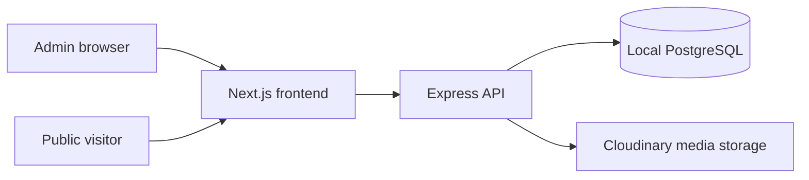

# Personal Learning Notes

A local-first TypeScript application for publishing learning notes. It contains a public Next.js site, a protected Express API, a PostgreSQL database accessed through Prisma, a Tiptap rich-text editor, local file uploads, resource links, PDF export, and note version snapshots. It has no AWS, Docker, Terraform, or paid hosting dependency.

## Architecture



The public website sees only `PUBLISHED` notes. The administrator uses a signed JWT to create, edit, import, export, and upload attachments. PostgreSQL is the only data store; semantic embeddings and RAG are intentionally out of scope.

## Repository layout

- `frontend/` — Next.js public pages and protected Markdown editor with live preview.
- `backend/` — Express API, Prisma schema, JWT authentication, Cloudinary uploads, and API tests.
- Cloudinary — persistent image and PDF storage for deployments; credentials remain backend-only.

## Free local setup (no Docker)

Prerequisites: Node.js 20+, npm, and a locally installed PostgreSQL 16+ server. PostgreSQL is free and can run as a normal local service.

1. Create a local database and user. Run the following in `psql` as your PostgreSQL administrator:

   ```sql
   CREATE USER notes WITH PASSWORD 'notes';
   CREATE DATABASE learning_notes OWNER notes;
   ```

2. Copy `.env.example` to `backend/.env`. The default `DATABASE_URL` works with the database above. Replace `JWT_SECRET` and `ADMIN_PASSWORD` with your own values.

3. Create `frontend/.env.local` containing:

   ```env
   NEXT_PUBLIC_API_URL=http://localhost:4000/api
   ```

4. Install packages and prepare the database. After this update, create a migration for `Resource` links:

   ```powershell
   npm.cmd install
   npm.cmd run prisma:generate --workspace=backend
   npm.cmd run prisma:migrate --workspace=backend -- --name init
   npm.cmd run prisma:seed --workspace=backend
   ```

5. Start both applications:

   ```powershell
   npm.cmd run dev
   ```

Visit `http://localhost:3000/admin` and sign in with the `ADMIN_EMAIL` and `ADMIN_PASSWORD` from `backend/.env`.

## Mobile and PWA

The interface is responsive and includes a web app manifest plus offline service-worker caching. On your computer, open it in Chrome or Edge and use **Install app** from the browser menu. On a phone connected to the same Wi-Fi, use `http://<your-computer-LAN-IP>:3000` for responsive testing; allow the Windows firewall prompt for Node.js if it appears. PWA installation and service-worker caching on a phone require HTTPS, so they become fully available after a future HTTPS deployment (such as Vercel or Cloudflare Pages).

## REST API

| Method | Endpoint | Purpose |
|---|---|---|
| POST | `/api/auth/login` | Sign in and get a JWT |
| GET/POST | `/api/notes` | List public notes / create a note |
| POST | `/api/notes/import` | Create a note from Markdown |
| GET/PUT/DELETE | `/api/notes/:id` | Read / update / delete a note |
| DELETE | `/api/notes/:id/attachments/:attachmentId` | Delete one uploaded attachment |
| GET | `/api/notes/:id/export/markdown` | Download Markdown |
| GET | `/api/notes/:id/export/pdf` | Download a basic PDF |
| GET/POST | `/api/tags` | List / create tags |
| POST | `/api/uploads/:noteId` | Upload a supported attachment to Cloudinary |

Protected calls require `Authorization: Bearer <token>`. Updates save a snapshot in `NoteVersion`, preserving a durable history in PostgreSQL.

## File uploads

The API accepts PNG, JPEG, WebP, GIF, and PDF files up to 10 MB. It sends these files from the protected backend to Cloudinary and stores the returned HTTPS URL in PostgreSQL. Add `CLOUDINARY_URL` to `backend/.env` locally and to Render in production. Never expose this variable in frontend code or Vercel environment variables.

### Enable PDF delivery on Cloudinary Free

Cloudinary Free accounts accept PDF uploads but block their public delivery by default, which appears as an HTTP 401 when a reader opens the attachment. In the Cloudinary Console, open **Settings → Security**, find **PDF and ZIP files delivery**, enable **Allow delivery of PDF and ZIP files**, accept the confirmation, and save. This is an account-level security setting, so it applies to existing and future PDF attachments. If a previously blocked URL still returns 401 after enabling it, wait briefly for the CDN error cache to expire and retry in a private browser window.

## Quality and security checks

- Zod validates every login, tag, import, and note write payload.
- Prisma parameterizes database access and models relations safely.
- JWTs protect all administrative routes; use a long random `JWT_SECRET`.
- Uploads use an extension-independent MIME allowlist, a 10 MB limit, and generated filenames.
- Markdown renders without raw HTML injection.

Run checks locally with:

```powershell
npm.cmd run lint
npm.cmd test
npm.cmd run build
```
